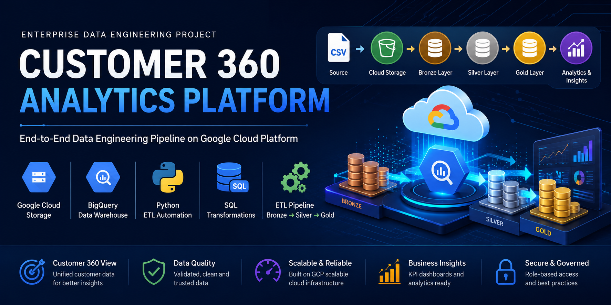
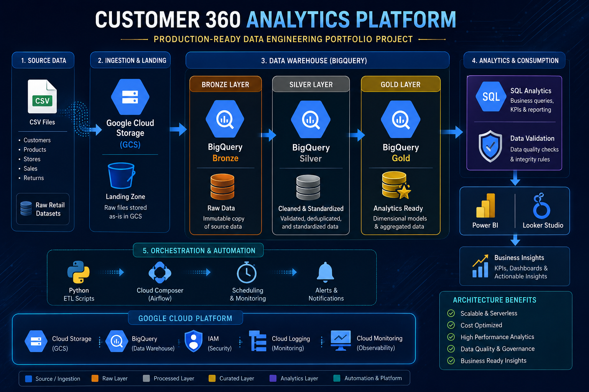
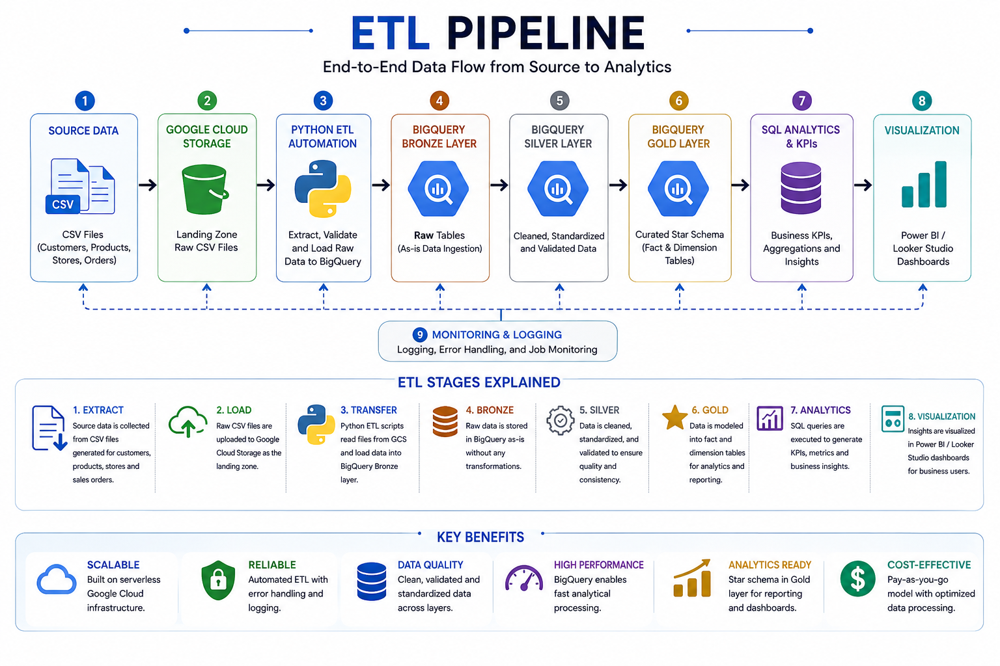
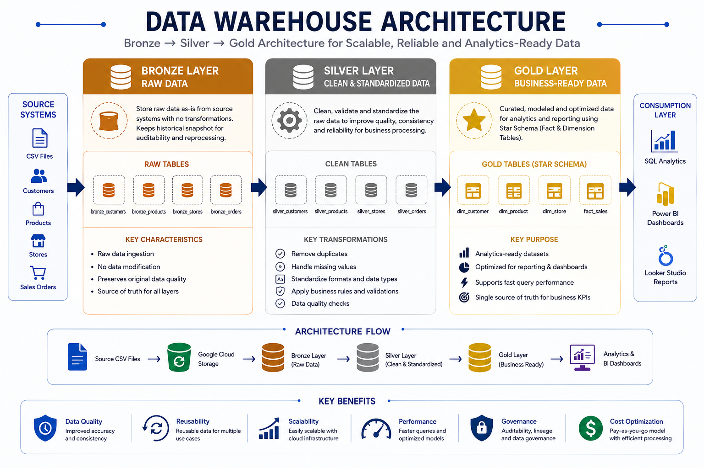
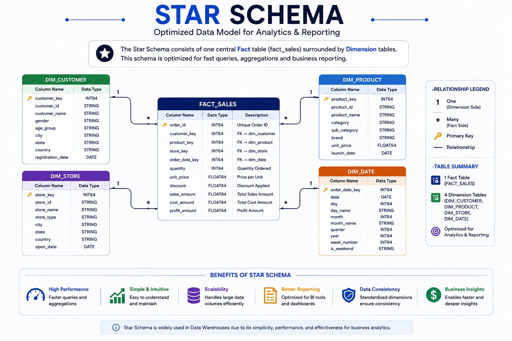

<p align="center">
  
</p>

<h1 align="center">🚀 Customer 360 Analytics Platform</h1>

<h3 align="center">
Production-Ready Data Engineering Portfolio Project
</h3>

<p align="center">


</p>

---

## 🌟 Project Highlights

| Feature | Details |
|---------|---------|
| ☁️ Cloud Platform | Google Cloud Platform (GCP) |
| 🗄 Data Warehouse | BigQuery |
| 🐍 Programming Language | Python |
| 📝 Transformation | SQL |
| 🏗 Architecture | Bronze → Silver → Gold |
| 📊 Reporting | Power BI / Looker Studio |
| 🔄 ETL Type | Batch ETL |
| 📦 Source | CSV Files |
| 📈 Target | Analytics-Ready Data Warehouse |

---
## ✨ Repository Features

- ✅ End-to-End ETL Pipeline
- ✅ Google Cloud Storage Integration
- ✅ BigQuery Data Warehouse
- ✅ Bronze → Silver → Gold Architecture
- ✅ Star Schema Data Model
- ✅ SQL-based Data Transformation
- ✅ Automated Data Validation
- ✅ Business KPI Analytics
- ✅ Dashboard Integration
- ✅ Production-Ready Documentation

---

## 📌 Project Overview

The **Customer 360 Analytics Platform** is a production-style Data Engineering project built on **Google Cloud Platform (GCP)**.

It demonstrates how raw retail data is transformed into trusted analytical datasets using the **Bronze → Silver → Gold** architecture.

The project automates data ingestion, transformation, validation, and business analytics using **Python**, **SQL**, **Google Cloud Storage**, and **BigQuery**.

---
## 📚 Table of Contents

- [Project Overview](#-project-overview)
- [Solution Architecture](#-solution-architecture)
- [Technology Stack](#️-technology-stack)
- [ETL Pipeline](#-etl-pipeline)
- [Data Warehouse Architecture](#️-data-warehouse-architecture)
- [Star Schema](#-star-schema)
- [Project Structure](#-project-structure)
- [Project Statistics](#-project-statistics)
- [Business KPIs](#-business-kpis)
- [Data Validation](#-data-validation)
- [Project Screenshots](#-project-screenshots)
- [Installation & Setup](#-installation--setup)
- [Project Execution](#️-project-execution)
- [Future Enhancements](#-future-enhancements)
- [Author](#-author)

---

# 🏗️ Solution Architecture

The Customer 360 Analytics Platform follows a modern multi-layered data engineering architecture. Raw retail datasets are ingested into Google Cloud Storage, transformed through Bronze, Silver, and Gold layers in BigQuery, validated for quality, and finally exposed for analytics and dashboarding.

<p align="center">
  
</p>

### Key Highlights

- ☁️ Cloud-native architecture on Google Cloud Platform
- 🥉 Bronze layer for raw data preservation
- 🥈 Silver layer for data cleansing and standardization
- 🥇 Gold layer for analytics-ready dimensional models
- 🐍 Automated ETL using Python
- 🗄️ SQL transformations in BigQuery
- 📊 Business-ready datasets for dashboards and reporting

---

# 📊 Repository Metrics

| Metric | Value |
|---------|------:|
| 👥 Customer Records | 5,000 |
| 📦 Product Records | 500 |
| 🧾 Sales Orders | 100,000 |
| 🗄 Bronze Tables | 4 |
| 🥈 Silver Tables | 4 |
| 🥇 Gold Tables | 4 |
| 🐍 Python Scripts | 10+ |
| 📝 SQL Scripts | 4 |
| 📊 Analytics Queries | 8+ |

---

# ⚙️ Technology Stack

This project leverages modern cloud-native technologies to build a scalable, production-ready data engineering pipeline.

| Category | Technology | Purpose |
|----------|------------|---------|
| ☁️ Cloud Platform | Google Cloud Platform (GCP) | Cloud infrastructure |
| 📦 Storage | Google Cloud Storage | Raw data storage |
| 🗄 Data Warehouse | BigQuery | Analytical data warehouse |
| 🐍 Programming | Python | ETL automation |
| 📝 Query Language | SQL | Data transformation & analytics |
| 🔄 Architecture | Bronze → Silver → Gold | Multi-layer data processing |
| 📊 Visualization | Power BI / Looker Studio | Business dashboards |
| 🔧 Version Control | Git & GitHub | Source code management |

---
# 🎓 Key Learning Outcomes

This project demonstrates practical experience in:

- Google Cloud Storage (GCS)
- BigQuery
- Python ETL Development
- SQL Data Transformation
- Star Schema Design
- Data Warehouse Modelling
- Medallion Architecture
- Business KPI Reporting
- Data Validation
- Dashboard Integration

---

## 🛠️ Core Technologies

<div align="center">

| Technology | Usage |
|------------|-------|
| 🐍 Python | Data generation, ETL automation |
| ☁️ Google Cloud Storage | Landing zone for raw datasets |
| 🗄 BigQuery | Data warehouse & SQL analytics |
| 📑 SQL | Data transformation and KPI reporting |
| 📊 Power BI | Interactive business dashboards |
| 🔀 Git | Version control |
| 🐙 GitHub | Project repository |

</div>

---
# 🔄 End-to-End Workflow

```text
Generate Sample Data
        │
        ▼
Upload CSV Files to GCS
        │
        ▼
Load into BigQuery Bronze
        │
        ▼
Transform to Silver Layer
        │
        ▼
Create Gold Star Schema
        │
        ▼
Execute SQL Analytics
        │
        ▼
Validate Data
        │
        ▼
Build Dashboard
```

---
# 🔄 ETL Pipeline

The ETL (Extract, Transform, Load) pipeline automates the movement of data from raw CSV files to an analytics-ready data warehouse. The implementation follows a layered architecture that improves data quality, scalability, and maintainability.

<p align="center">
  
</p>

---

## 🔄 ETL Workflow

```text
Source CSV Files
        │
        ▼
Google Cloud Storage (Landing Zone)
        │
        ▼
Python ETL Automation
        │
        ▼
BigQuery Bronze Layer
        │
        ▼
BigQuery Silver Layer
        │
        ▼
BigQuery Gold Layer
        │
        ▼
SQL Analytics & KPIs
        │
        ▼
Power BI / Looker Studio
```

---

## ⚙️ ETL Stages

| Stage | Description |
|--------|-------------|
| 📥 Extract | Generate and collect customer, product, store, and sales datasets |
| ☁️ Load | Upload source files to Google Cloud Storage |
| 🥉 Bronze | Store raw data without modification |
| 🥈 Silver | Clean, validate, standardize, and transform data |
| 🥇 Gold | Build analytics-ready fact and dimension tables |
| 📊 Analytics | Execute SQL queries for KPIs and business reporting |
| 📈 Visualization | Connect Power BI / Looker Studio dashboards |

---

## 🎯 ETL Design Principles

- Automated execution using Python
- Modular SQL transformations
- Layered data architecture
- Data quality validation
- Scalable cloud-native processing
- Analytics-ready outputs

---

---

# 🏛️ Data Warehouse Architecture

The Customer 360 Analytics Platform follows the **Bronze → Silver → Gold** architecture to transform raw operational data into trusted, analytics-ready datasets.

This layered approach improves data quality, simplifies maintenance, and enables scalable analytical processing.

<p align="center">
    
</p>

---

## 🥉 Bronze Layer – Raw Data

The Bronze layer stores raw data exactly as received from the source systems.

### Purpose

- Preserve original source data
- Enable auditability
- Support reprocessing when required
- Maintain historical snapshots

### Tables

| Dataset | Description |
|----------|-------------|
| customers | Raw customer records |
| products | Raw product catalogue |
| stores | Raw store information |
| orders | Raw sales transactions |

---

## 🥈 Silver Layer – Clean & Standardized

The Silver layer transforms raw data into clean, validated, and standardized datasets.

### Processing

- Remove duplicates
- Handle missing values
- Standardize formats
- Validate data quality
- Apply business rules

### Benefits

- Improved consistency
- Higher data quality
- Reliable analytical foundation

---

## 🥇 Gold Layer – Business Ready

The Gold layer contains curated dimensional models optimized for reporting and analytics.

### Tables

| Table | Type |
|--------|------|
| dim_customer | Dimension |
| dim_product | Dimension |
| dim_store | Dimension |
| fact_sales | Fact |

---

## ⭐ Why Bronze → Silver → Gold?

| Layer | Objective |
|---------|-----------|
| 🥉 Bronze | Preserve raw source data |
| 🥈 Silver | Improve data quality |
| 🥇 Gold | Deliver analytics-ready datasets |

---

## 🚀 Business Benefits

- Better data quality
- Faster SQL queries
- Reusable ETL pipeline
- Scalable cloud architecture
- Reliable business reporting
- Easier maintenance

---
# ⭐ Star Schema

The Gold Layer is designed using a **Star Schema** to provide a simple, high-performance data model for business analytics and reporting.

A Star Schema organizes data into **Fact Tables** and **Dimension Tables**, enabling faster SQL queries, simplified reporting, and efficient dashboard development.

<p align="center">
    
</p>

---

## 📐 Data Model

```text
                    dim_customer
                         │
                         │ 1
                         │
                         *
                    fact_sales
                  *     │      *
                 /      │       \
                /       │        \
               1        1         1
      dim_product   dim_store   dim_date
```

---

## 📋 Fact Table

The **Fact Table** stores measurable business events and references the related dimensions.

| Table | Description |
|--------|-------------|
| fact_sales | Stores sales transactions, quantities, revenue, discounts, and foreign keys to all dimensions |

### Key Metrics

- Total Revenue
- Total Orders
- Quantity Sold
- Profit
- Discount Amount

---

## 📚 Dimension Tables

Dimension tables provide descriptive attributes used for filtering, grouping, and reporting.

| Dimension | Description |
|-----------|-------------|
| dim_customer | Customer information |
| dim_product | Product details |
| dim_store | Store information |
| dim_date | Calendar and time attributes |

---

## 🔗 Relationships

| From | Relationship | To |
|------|-------------|----|
| dim_customer | 1 → * | fact_sales |
| dim_product | 1 → * | fact_sales |
| dim_store | 1 → * | fact_sales |
| dim_date | 1 → * | fact_sales |

---

## 📊 Business Use Cases

The Star Schema supports business reporting such as:

- 💰 Total Revenue Analysis
- 📦 Product Performance
- 👥 Customer Segmentation
- 🏪 Store Performance
- 📅 Monthly Sales Trends
- 🌍 Regional Revenue Analysis
- ⭐ Top Customers
- ⭐ Top Products

---

## 🚀 Benefits of Star Schema

| Benefit | Description |
|---------|-------------|
| Faster Queries | Optimized joins improve query performance |
| Easy Reporting | Simplifies dashboard and BI development |
| Better Performance | Reduces query complexity |
| Scalability | Supports large analytical workloads |
| Business Friendly | Easy for analysts to understand |
| Reusable | Common model for multiple reports |

---

## 🎯 Example Analytics

Example questions that can be answered using the Star Schema:

- Which products generate the highest revenue?
- Which customers contribute the most sales?
- Which stores perform best each month?
- How do sales trends change over time?
- What is the revenue by region and product category?

---

# 📁 Project Structure

The repository is organized following a clean and modular project structure to simplify development, maintenance, and future enhancements.

```text
customer-360-analytics-platform
│
├── assets
│   ├── banner
│   │   └── banner.png
│   │
│   └── diagrams
│       ├── architecture.png
│       ├── technology_stack.png
│       ├── etl_pipeline.png
│       ├── bronze_silver_gold.png
│       └── star_schema.png
│
├── architecture
│
├── config
│
├── dashboard
│
├── data
│   ├── raw
│   └── processed
│
├── docs
│
├── logs
│
├── python
│
├── screenshots
│
├── sql
│
├── README.md
├── requirements.txt
├── LICENSE
└── .gitignore
```

---

## 📂 Folder Description

| Folder | Description |
|---------|-------------|
| 📂 assets | Repository banners, diagrams and images |
| 🏗 architecture | Architecture source files and diagrams |
| ⚙ config | Configuration files |
| 📊 dashboard | Power BI dashboard files |
| 📁 data | Raw and processed sample datasets |
| 📚 docs | Project documentation |
| 📝 logs | ETL execution logs |
| 🐍 python | Python ETL automation scripts |
| 📸 screenshots | Execution and validation screenshots |
| 🗄 sql | SQL transformation and analytics queries |

---

# 📊 Project Statistics

| Metric | Value |
|--------|------:|
| Customer Records | 5,000 |
| Product Records | 500 |
| Sales Orders | 100,000 |
| Bronze Tables | 4 |
| Silver Tables | 4 |
| Gold Tables | 4 |
| SQL Scripts | 4 |
| Python Scripts | 10+ |
| Cloud Platform | Google Cloud Platform |
| Data Warehouse | BigQuery |

---
## 📈 Business KPIs

| KPI | Business Objective |
|------|--------------------|
| 💰 Total Revenue | Measure overall sales performance |
| 🧾 Total Orders | Track order volume |
| 👥 Customer Count | Monitor customer growth |
| 📦 Product Performance | Identify best-selling products |
| 🌍 Revenue by Region | Compare regional performance |
| 🏪 Revenue by Store | Evaluate store efficiency |
| 📅 Monthly Sales Trend | Analyse business growth over time |
| ⭐ Top Customers | Identify high-value customers |
| ⭐ Top Products | Measure product demand |
| 📊 Order Status | Monitor order fulfilment |

---

# 💼 Business Impact

The Customer 360 Analytics Platform enables organizations to:

- Improve reporting accuracy through standardized datasets.
- Reduce manual reporting effort with automated ETL.
- Deliver analytics-ready data for BI tools.
- Support faster business decisions using curated KPIs.
- Build a scalable foundation for future data engineering initiatives.

---
# 📊 Dashboard Preview

The analytics-ready Gold Layer powers an interactive business intelligence dashboard built on the curated dimensional model.

The dashboard provides decision-makers with real-time insights into sales performance, customer behaviour, product trends, and regional business growth.

---

<p align="center">
    
</p>

---

## 📈 Executive KPIs

| KPI | Description |
|------|-------------|
| 💰 Total Revenue | Overall business revenue generated |
| 🧾 Total Orders | Number of completed sales orders |
| 👥 Total Customers | Active customer count |
| 📦 Total Products | Products available for sale |
| 🏪 Total Stores | Number of operational stores |
| 📊 Average Order Value | Average revenue per order |

---

## 📉 Business Insights

The dashboard enables business users to analyse:

- Monthly Revenue Trends
- Regional Sales Performance
- Top Performing Products
- Top Customers by Revenue
- Store-wise Performance
- Category-wise Sales Distribution
- Customer Purchase Behaviour
- Sales by Time Period

---

## 📷 Dashboard Pages

| Dashboard | Purpose |
|-----------|----------|
| Executive Summary | Overall business KPIs |
| Sales Analysis | Revenue and order trends |
| Customer Analysis | Customer segmentation and purchasing behaviour |
| Product Analysis | Product performance and profitability |
| Store Performance | Revenue by store and region |

---

## 🎯 Business Value

The dashboard helps stakeholders to:

- Monitor business performance
- Identify top-performing products
- Analyse customer purchasing patterns
- Track regional sales growth
- Support strategic decision-making
- Improve operational efficiency

---
# 📸 Project Screenshots

The following screenshots demonstrate the end-to-end execution of the data engineering pipeline.

## Google Cloud Storage


*Raw CSV files uploaded to Google Cloud Storage.*

---

## BigQuery Datasets


*Datasets created for Bronze, Silver, and Gold layers.*

---

## Bronze Layer


*Raw data successfully loaded into BigQuery Bronze tables.*

---

## Silver Layer


*Data cleaned, validated, and standardized in the Silver layer.*

---

## Gold Layer


*Analytics-ready dimensional model with fact and dimension tables.*

---

## SQL Analytics


*Business analytics queries executed successfully.*

---

## Data Validation


*Pipeline validation confirming successful execution and data quality.*

---

## Business Dashboard


*Interactive dashboard displaying key business KPIs.*
---

# 🚀 Installation & Setup

## Prerequisites

Before running the project, ensure the following tools are installed:

- Python 3.11+
- Google Cloud SDK
- Git
- BigQuery Access
- Google Cloud Storage Access

---

## Clone Repository

```bash
git clone https://github.com/manjitsharma066-debug/customer-360-analytics-platform.git

cd customer-360-analytics-platform
```

---

## Install Dependencies

```bash
pip install -r requirements.txt
```

---

## Configure Google Cloud

```bash
gcloud auth login

gcloud config set project YOUR_PROJECT_ID
```

---

## Verify Configuration

```bash
gcloud config list

bq ls
```

---
# ▶️ Project Execution

Execute the pipeline in the following order.

## Step 1

Generate sample datasets

```bash
python python/generate_customers.py

python python/generate_products.py

python python/generate_orders.py
```

---

## Step 2

Upload datasets

```bash
python python/upload_to_gcs.py
```

---

## Step 3

Load into BigQuery

```bash
python python/load_bigquery.py
```

---

## Step 4

Run SQL Transformations

```bash
python python/run_sql.py
```

---

## Step 5

Run Analytics

```bash
python python/run_analytics.py
```

---

## Step 6

Validate Pipeline

```bash
python python/validate_pipeline.py
```

---

Expected Result

- Bronze Layer Created
- Silver Layer Created
- Gold Layer Created
- Validation Passed
- Analytics Generated

---
# 📊 Data Validation

The pipeline includes automated validation to ensure data quality before analytics.

## Validation Checks

- Row Count Validation
- Duplicate Detection
- Null Value Checks
- Referential Integrity
- Schema Validation
- Data Quality Rules

---

## Validation Summary

| Check | Status |
|---------|--------|
| Row Count | ✅ Passed |
| Customer Integrity | ✅ Passed |
| Product Integrity | ✅ Passed |
| Store Integrity | ✅ Passed |
| Order Integrity | ✅ Passed |

---
# 🧠 Skills Demonstrated

| Category | Skills |
|----------|--------|
| Cloud | Google Cloud Platform, Google Cloud Storage |
| Data Warehouse | BigQuery |
| Programming | Python |
| SQL | DDL, DML, Joins, Aggregations, Transformations |
| Data Engineering | ETL, Data Validation, Medallion Architecture |
| Data Modelling | Star Schema, Fact & Dimension Tables |
| Analytics | KPI Development, Business Reporting |
| Version Control | Git, GitHub |

---
# 🚀 Future Enhancements

The current implementation focuses on a batch ETL pipeline. Future versions will extend the platform with enterprise-grade capabilities.

## Planned Enhancements

- Apache Airflow orchestration
- Dataflow streaming pipelines
- Pub/Sub event-driven ingestion
- Docker containerization
- Terraform infrastructure deployment
- CI/CD with GitHub Actions
- dbt transformations
- Data Catalog integration
- Cloud Monitoring & Alerting
- Real-time dashboards

---

# 👨‍💻 Author

**Manjit Kumar Sharma**

Production-Ready Data Engineering Portfolio Project

### Connect

- GitHub: https://github.com/manjitsharma066-debug
- LinkedIn: *(www.linkedin.com/in/manjit-kumar-sharma-2bbb93324e)*

---


<div align="center">

# ⭐ Thank You for Visiting

If you found this project useful, consider giving it a ⭐ on GitHub.

It helps support the project and encourages future improvements.

---

### Built with


---

### Technologies

Google Cloud Platform • BigQuery • Python • SQL • Power BI • GitHub

---

**Customer 360 Analytics Platform**

Production-Ready Data Engineering Portfolio Project

Version **1.0.0**

© 2026 Manjit Kumar Sharma

</div>